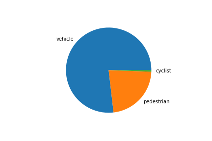
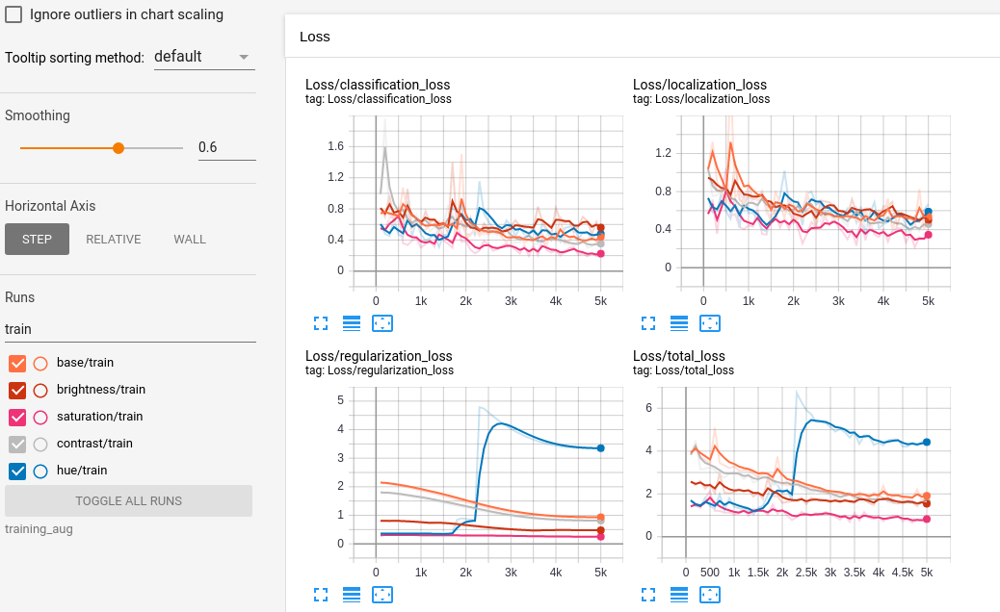

# Data
## Download tfrecords
In first step I modified `download_process.py` to ignore files which were downloaded earlier.

## Exploratory Data Analysis and Split Creation
### Data analys
Let's take a look at 10 random frames.


We have frames day and night. Some have pedestrians, some have cars. But no cyclist.

Take look at the distribution of objects. 
```
total number of the vehicle is 17812707
total number of the pedestrian is 5235971
total number of the cyclist is 133228
```



Main objects in frames are vehicles. Almost everyone else is pedestrian.
Cyclist is very rare object.

### Create the splits
Create cross validation split from  download tfrecords. 
To save disk space I created soft link in [script](create_splits.py).
I took 85/15 test/validate distribution. 

## Training
### Train on base parameters.
When I execute train scripts I had some problems. 
* Out of memory. To avoid this problem batch_size was decreased to 3. 
* TypeError in evaluation step. 
This problem was fixed when `metrics_set` was changed by `pascal_voc_detection_metrics`. 
[Link to knowledge forum.](https://knowledge.udacity.com/questions/657618) 

```
mAP@0.5IOU: 0.022209
vehicle: 0.044410
pedestrian: 0.000007
cyclist: nan
localization_loss: 0.426995
classification_loss: 0.383666
regularization_loss: 2.621263
total_loss: 3.431924
```


There outlier in ~3k iteration. 
Only after 15k iteration it was fixed.

Let use this result as started. 

`Note`. Cyclists not detected.


### Modifications.
#### Resnet101.
In first attempt I change `feature_extractor` from `resnet50` to `resnet101` in [pipeline](training/reference_resnet101/pipeline_new.config).
Unfortunately this method use more memory. 
`batch_size` was decreased to 2   

Compare with previous result:

Orange is `resnet50`, red is `resnet101`

Validation 

|Metric|reference|reference_resnet101|
|---|---|---|
|mAP@0.5IOU|0.022209|0.000007|
|vehicle|0.044410|0.000014|
|pedestrian|0.000007|0.000000|
|cyclist|nan|nan|
|localization_loss|0.426995|0.871480|
|classification_loss|0.383666|3844.752441|
|regularization_loss|2.621263|83611426816.000000|
|total_loss|3.431924|83611435008.000000|

The same problem in the middle of training.   
First pipeline peak is not even noticeable.
Result of this configuration was worse than with `resnet50`. 
mAP was smaller, losses is higher. Cyclist still not detected.


#### Chose augmentations
Let chose which augmentations are usefully.
On [github](https://github.com/tensorflow/models/blob/master/research/object_detection/configs/tf2/centernet_resnet50_v1_fpn_512x512_kpts_coco17_tpu-8.config)
I found 4 additional augmentations. Let compare them. 

After 5000 steps I get this results.


|Metric|base|brightness|contrast|hue|saturation|
|---|---|---|---|---|---|
|mAP@0.5IOU|0.022741|0.004134|0.020864|0.011853|0.088740|
|vehicle|0.040212|0.008268|0.038411|0.023705|0.085034|
|pedestrian|0.005270|0.000000|0.003317|0.000000|0.092446|
|cyclist|nan|nan|nan|nan|nan|
|localization_loss|0.471098|0.527493|0.467940|0.512353|0.311701|
|classification_loss|0.400740|0.573891|0.410597|0.457218|0.246451|
|regularization_loss|0.931825|0.476191|0.813249|3.346019|0.250153|
|total_loss|1.803663|1.577576|1.691786|4.315590|0.808306|

Pipeline with hue catch the main problem. Another augmentations were more effective. 
`regularization_loss`  and `total_loss` was smaller for them during whole training.

#### Train with augmentations
I add to base [pipeline](training/reference_aug/pipeline_new.config) three augmentation:
* random_adjust_brightness
* random_adjust_contrast
* random_adjust_saturation


|Metric|reference|reference_aug|
|---|---|---|
|mAP@0.5IOU|0.022209|0.052885|
|vehicle|0.044410|0.066866|
|pedestrian|0.000007|0.038904|
|cyclist|nan|nan|
|localization_loss|0.426995|0.363968|
|classification_loss|0.383666|0.319939|
|regularization_loss|2.621263|0.368081|
|total_loss|3.431924|1.051989|

This pipeline has no outlier in loss graph and has trained more stable.
It has less loss error during all training and validation.
Improvements have been done.  

### Known issues
* Small memory on gpu.
* Metrics_set 
* Unexpected outlier during train.


### Improvements suggestions.
* Compare with another feature_extractor.
* Use more powerful hardware. 
* Use another augmentations.
* Use bigger dataset.
* Duplicate frames with cyclist.
